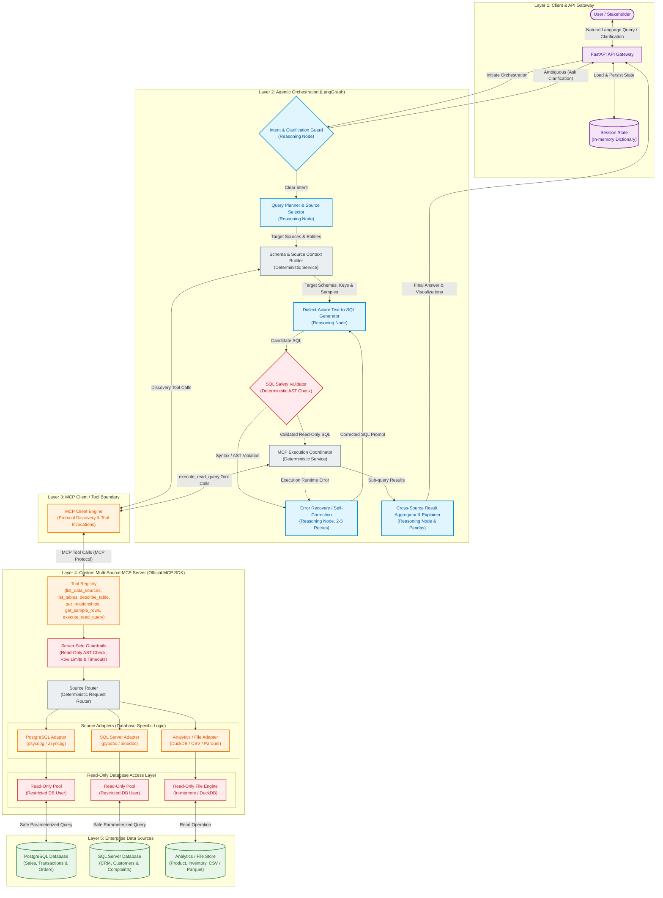

# Multi-Source Agentic Text-to-SQL with MCP

An agentic data analyst that converts natural-language questions into safe, multi-source SQL queries and synthesizes results through a custom MCP tool layer.

---

## Project Overview

Users ask analytical questions across enterprise data stores in natural language. When requests are underspecified, the system detects ambiguity and prompts the user for clarification before running expensive operations. It identifies which heterogeneous data sources are needed, dynamically retrieves the relevant schemas and table relationships, and generates dialect-aware SQL tailored to each backend. Before any query touches a database, an AST-based safety validator ensures it is strictly read-only. Queries are executed through a custom Model Context Protocol (MCP) server that interfaces with disparate databases using read-only adapters, automatically recovering and self-correcting if runtime errors occur. Finally, the system aggregates cross-source query results in-memory and delivers a synthesized, plain-language answer with optional visualizations.

---

## Why Agentic?

Unlike a basic Text-to-SQL pipeline, the system can:

- Clarify incomplete user intent before querying.
- Decompose complex questions into source-specific sub-queries.
- Select relevant data sources and schemas dynamically.
- Recover from SQL execution errors and retry with corrected queries.
- Aggregate results across multiple sources before generating the final answer.

---

## Key Features

- **Conversational Clarification:** Resolves ambiguities and missing parameters directly with the user before executing queries.
- **Multi-Source Query Planning:** Decomposes cross-domain questions into targeted, source-specific sub-queries.
- **Schema & Relationship Discovery:** Dynamically inspects table schemas, foreign key links, and sample rows on demand.
- **Dialect-Aware Text-to-SQL:** Generates syntactically correct SQL tailored to PostgreSQL, SQL Server, and DuckDB dialects.
- **AST-Based Safety Validation:** Statically parses candidate SQL using an AST to reject mutation statements (`INSERT`, `UPDATE`, `DELETE`, `DROP`) and enforce row limits.
- **MCP-Based Tool Execution:** Routes queries through a custom MCP server, enforcing standardized tool access and isolating database credentials.
- **Automatic Error Recovery:** Catches runtime database errors and feeds error traces back into the generator for self-correction.
- **Cross-Source Result Aggregation:** Merges tabular outputs from multiple distinct databases in-memory to provide unified answers and chart configurations.

---

## Architecture



### Architecture at a Glance

1. **FastAPI Gateway:** Handles user requests and in-memory conversation state.
2. **LangGraph Orchestrator:** Manages clarification, planning, SQL generation, validation, execution, recovery, and aggregation.
3. **MCP Client:** Provides the standardized tool boundary between the agent and data layer.
4. **Custom MCP Server:** Exposes controlled read-only tools and routes requests to source-specific adapters.
5. **Data Sources:** Includes PostgreSQL, SQL Server, and analytics/file stores (DuckDB/CSV/Parquet).

> **LangGraph decides what needs to happen; MCP provides the standardized tool boundary; the MCP server decides how to access each data source.**

---

## MCP Tools

```text
list_data_sources()
list_tables(source)
describe_table(source, table)
get_relationships(source)
get_sample_rows(source, table)
execute_read_query(source, validated_sql)
```

The custom MCP server exposes these tools through the official MCP SDK. All query execution is read-only and is routed through source-specific adapters.

---

## Security

```text
Agent-generated SQL
        ↓
AST / SQL Safety Validator
        ↓
MCP Server Guardrails
        ↓
Read-Only Database Credentials
        ↓
Data Source
```

- Rejects non-read operations such as `INSERT`, `UPDATE`, `DELETE`, `DROP`, `ALTER`, and `TRUNCATE`.
- Applies row/result limits and execution timeouts.
- Uses database-level read-only credentials as a second security boundary.

---

## Workflow

```text
User Query
   ↓
Intent & Clarification
   ↓
Query Planning & Source Selection
   ↓
Schema Discovery via MCP
   ↓
Dialect-Aware Text-to-SQL
   ↓
SQL Safety Validation
   ↓
MCP Execution
   ↓
Self-Correction on Runtime Errors
   ↓
Cross-Source Aggregation
   ↓
Final Answer / Visualization
```

### Example Walkthrough

* **User Query:** *"Which region had the highest revenue and most customer complaints last quarter?"*
* **Clarification:** The agent detects ambiguous metric phrasing and verifies whether revenue refers to gross sales or net margin before proceeding.
* **Planning & Discovery:** The planner identifies that sales data resides in PostgreSQL and complaint logs reside in SQL Server, then fetches only the relevant table schemas and foreign keys via MCP.
* **Execution & Aggregation:** Validated read-only SQL queries run across both sources via MCP. The aggregator joins the results by region in-memory and outputs a clear summary with comparative chart data.
