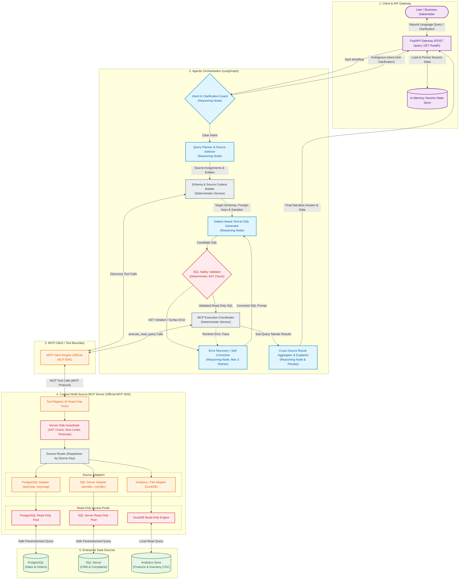

# Iteration 1 Implementation Plan: Multi-Source Agentic Text-to-SQL with MCP

> **Iteration 1 Boundary & Scope:**  
> This plan covers **only Iteration 1** of the project. The goal is to build a fully functional, local-first backend vertical slice: from natural-language query ingestion and clarification to dialect-aware SQL generation, AST safety validation, read-only multi-source execution via a custom MCP server, automated self-correction, and in-memory cross-source aggregation.  
> *Non-goals for Iteration 1:* No frontend, no Docker/Kubernetes, no cloud deployment, no Redis/external caches, no authentication, and no production microservices.

---

## Architecture & Security Reference

### System Architecture Diagram



### Defense-in-Depth Security Path

```text
Agent-Generated SQL
        ↓
[1] AST / SQL Safety Validator       (Pre-execution: parsed AST via SQLGlot, rejects non-SELECT, enforces LIMIT)
        ↓
[2] MCP Client Tool Call            (Protocol boundary: isolated tool arguments, no raw database handles)
        ↓
[3] MCP Server Guardrails           (Server-side check: timeout enforcement, table whitelisting, AST re-check)
        ↓
[4] Read-Only Database Credentials   (Connection level: read-only DB users, zero write/DDL privileges)
        ↓
[5] Target Enterprise Data Source   (Execution: zero data mutation capability)
```

---

## Iteration 1 Workflow Diagram

```text
User Query
   ↓
Intent & Clarification Guard
   ├── Ambiguous ──→ Emit Clarification Question ──→ Wait for User Input
   └── Clear
         ↓
Planning & Source Selection (Decompose cross-source query into sub-queries)
   ↓
Schema Discovery via MCP (Fetch tables, foreign keys, and sample rows)
   ↓
Dialect-Aware Text-to-SQL (Generate native queries for target engines)
   ↓
SQL Safety Validation (SQLGlot AST check: SELECT only, table allowlist, LIMIT)
   ↓
MCP Execution Coordinator (Dispatch validated queries through MCP Server)
   ↓
 ┌────────────────────── Execution Status Check ──────────────────────┐
 │                                                                    │
 │ Error? (Syntax, Column Mismatch, Type Error)                       │
 │  ↓                                                                 │
 │ Self-Correction Loop (Feed error trace + schema back to LLM)       │
 │  ↓                                                                 │
 │ Re-Validate via AST (Max 3 Retries)                                │
 │  ↓                                                                 │
 └─ Retry Execution                                                   │
                                                                      │
 Success?                                                             │
  ↓                                                                   │
 Cross-Source Result Aggregation (In-Memory Pandas join on shared keys)│
  ↓                                                                   │
 Result Explainer (Generate final narrative summary + chart structure)│
  ↓                                                                   │
 FastAPI (Return response & update in-memory session state)            │
```

---

## Phase 1 — Foundation & Data Sources

### Objective
Establish the repository skeleton, configuration management, and three local/accessible heterogeneous data sources. Seed realistic, relational sample data representing enterprise domains (sales, CRM, and inventory) and verify strict read-only database user credentials and connectivity before writing agent logic.

### What We Build
1. **Repository Layout:** Standardized modular directory structure separating `mcp_server`, `agent`, `api`, and data setup scripts.
2. **Environment & Config Management:** Pydantic-based settings (`config.py`) loading connection strings and LLM parameters from `.env`.
3. **PostgreSQL Store (Sales Domain):**
   - Tables: `regions`, `sales_reps`, `orders`, `order_items`.
   - Seed data: ~50 orders, quarterly dates, realistic regional amounts.
   - Dedicated read-only database user: `readonly_pg_user`.
4. **SQL Server Store (CRM Domain):**
   - Tables: `customers`, `complaints`.
   - Seed data: ~30 customers with `region_id` mapping, ~60 complaint tickets with severity, categories, and dates.
   - Dedicated read-only database user: `readonly_mssql_user`.
5. **Analytics / File Store (Product & Inventory Domain):**
   - Data files: `products.csv`, `inventory.csv`.
   - Accessible locally via an embedded `DuckDB` engine.
6. **Connectivity Verification Suite:** Automated scripts validating network connections, table presence, and foreign key relationships across all three sources.

### How It Works
* Seed SQL and DDL scripts initialize schemas on the local PostgreSQL and SQL Server instances.
* Relational linkages exist across systems via shared business dimensions: `regions.region_id` matches `customers.region_id`, and `order_items.product_id` matches `products.csv`.
* Restricted DB users are provisioned with `GRANT SELECT ON ALL TABLES` and `REVOKE ALL PRIVILEGES ON ALL TABLES` for mutations (`INSERT`, `UPDATE`, `DELETE`, `DROP`).
* Python test scripts execute sample queries using read-only credentials to guarantee valid connection pooling and permission enforcement.

### Files / Modules
* `src/config.py`: Pydantic settings schema (`DatabaseSettings`, `LLMSettings`, `MCPSettings`).
* `data/postgres/schema.sql`: PostgreSQL table DDL.
* `data/postgres/seed.sql`: PostgreSQL seed records and read-only user creation script.
* `data/sqlserver/schema.sql`: SQL Server table DDL.
* `data/sqlserver/seed.sql`: SQL Server seed records and read-only user creation script.
* `data/files/products.csv`: Product master catalog.
* `data/files/inventory.csv`: Warehouse inventory levels.
* `tests/test_connectivity.py`: Connectivity and permission verification tests.
* `requirements.txt`: Python package manifest.
* `.env.example`: Configuration template.

### Dependencies
* `pydantic-settings>=2.2.0`
* `psycopg2-binary>=2.9.9` (or `asyncpg>=0.29.0`)
* `pyodbc>=5.1.0` (or `aioodbc>=0.5.0`)
* `duckdb>=0.10.0`
* `python-dotenv>=1.0.1`
* `pytest>=8.0.0`

### Tests
* `test_postgres_connection()`: Connects with `readonly_pg_user`, verifies `SELECT * FROM orders` returns data.
* `test_postgres_readonly_enforcement()`: Confirms that running `DROP TABLE orders` or `INSERT INTO regions` raises permission denied errors.
* `test_sqlserver_connection()`: Connects with `readonly_mssql_user`, verifies `SELECT * FROM complaints` returns data.
* `test_sqlserver_readonly_enforcement()`: Confirms that mutation queries raise permission denied errors.
* `test_duckdb_file_access()`: Queries `products.csv` and `inventory.csv` via DuckDB, verifying row counts and column types.

### Deliverables
* Working project repository structure.
* Three accessible data sources with verified schemas and cross-source keys (`region_id`, `product_id`).
* Seed scripts executed and verified with read-only user credentials.
* Passing `test_connectivity.py` test suite.

### Exit Criteria
* All three data sources return valid tabular rows when queried with read-only credentials.
* Mutation queries fail at the database level on both PostgreSQL and SQL Server.
* `pytest tests/test_connectivity.py` passes 100%.

---

## Phase 2 — Custom Multi-Source MCP Server

### Objective
Implement a standalone, custom Model Context Protocol (MCP) server using the official MCP SDK. Expose a compact, strictly read-only 6-tool interface with dynamic source routing and server-side safety guardrails, insulating the agent reasoning layer from physical database drivers.

### What We Build
1. **MCP Server Core:** Server instance initialized using the official Python MCP SDK with Stdio or SSE transport.
2. **Tool Registry:** Six read-only tools with strict Pydantic parameter schemas:
   - `list_data_sources()`: Returns IDs and descriptions (`sales_pg`, `crm_mssql`, `analytics_duckdb`).
   - `list_tables(source: str)`: Returns table names available within the requested source.
   - `describe_table(source: str, table: str)`: Returns column names, data types, primary keys, and nullable flags.
   - `get_relationships(source: str)`: Returns explicit foreign key definitions and cross-table linkages.
   - `get_sample_rows(source: str, table: str)`: Returns top 3–5 representative rows for formatting context.
   - `execute_read_query(source: str, validated_sql: str)`: Executes read-only queries with strict bounds.
3. **Source Router:** Central dispatcher that examines `source` and directs calls to the appropriate backend adapter.
4. **Source Adapters:**
   - `PostgresAdapter`: Manages read-only connection pooling and queries metadata from `information_schema`.
   - `SQLServerAdapter`: Manages connection pooling and queries metadata from `INFORMATION_SCHEMA` and `sys.foreign_keys`.
   - `DuckDBFileAdapter`: Handles in-memory DuckDB queries against Parquet/CSV files.
5. **Server-Side Guardrails:**
   - Secondary AST parse verifying `SELECT` / `WITH` statements.
   - Query execution timeout (e.g., 5 seconds max).
   - Enforced maximum row cap (e.g., hard limit of 200 rows returned to the agent).

### How It Works
* The MCP server registers the 6 tools and listens for tool call requests via the MCP protocol.
* When a discovery tool is called (e.g., `describe_table`), the `SourceRouter` resolves the target adapter, queries the database metadata catalog, and returns a structured JSON schema response.
* When `execute_read_query` is invoked, `ServerGuardrails` re-evaluates the query AST, sets a statement execution timeout, executes the query via the source adapter's read-only connection, and formats the output into clean tabular records.

### Files / Modules
* `src/mcp_server/server.py`: MCP server initialization, tool registration, and server lifecycle.
* `src/mcp_server/schemas.py`: Pydantic input schemas for all 6 tools.
* `src/mcp_server/router.py`: Source routing logic.
* `src/mcp_server/guardrails.py`: Server-side query timeout, row limit, and AST safety validation.
* `src/mcp_server/adapters/base.py`: Abstract base class defining adapter interface (`list_tables`, `describe_table`, `get_relationships`, `get_sample_rows`, `execute_query`).
* `src/mcp_server/adapters/postgres.py`: PostgreSQL adapter implementation.
* `src/mcp_server/adapters/sqlserver.py`: SQL Server adapter implementation.
* `src/mcp_server/adapters/duckdb_file.py`: DuckDB file adapter implementation.
* `tests/test_mcp_tools.py`: Unit and integration tests for all 6 MCP tools.

### Dependencies
* `mcp>=1.0.0` (Official Model Context Protocol SDK)
* `sqlglot>=23.0.0`
* `pandas>=2.2.0`
* `asyncpg` / `psycopg2-binary`
* `aioodbc` / `pyodbc`
* `duckdb`

### Tests
* `test_list_data_sources()`: Verifies that all 3 registered data sources are returned.
* `test_describe_table_and_relationships()`: Verifies schema and foreign keys returned for `orders` and `complaints`.
* `test_get_sample_rows()`: Confirms returned rows match requested row limits.
* `test_execute_read_query_success()`: Validates correct tabular results from PostgreSQL, SQL Server, and DuckDB.
* `test_execute_read_query_guardrail_rejection()`: Verifies that non-SELECT statements (`DELETE FROM customers`) are blocked by server guardrails with a structured error.
* `test_execute_read_query_timeout()`: Simulates a long query and verifies timeout enforcement.

### Deliverables
* Operational custom MCP server implemented with the official SDK.
* All 6 tools functional and tested across PostgreSQL, SQL Server, and DuckDB.
* Independent server guardrails preventing mutation statements and enforcing limits.
* Passing `test_mcp_tools.py` test suite.

### Exit Criteria
* All 6 tools execute correctly via MCP tool invocations without bypassing the router.
* Injection of mutation statements into `execute_read_query` is blocked by server guardrails.
* MCP client can connect, list tools, and invoke queries across all 3 backends.

---

## Phase 3 — LangGraph Agent Core

### Objective
Construct the core agentic reasoning state machine using LangGraph. Implement query intent evaluation with conversational clarification interrupts, cross-source sub-query decomposition planning, and dynamic just-in-time schema discovery via the MCP Client.

### What We Build
1. **LangGraph State Definition (`AgentState`):** Typed dictionary tracking:
   - `messages`: Conversation history.
   - `user_query`: Current user query string.
   - `clarification_needed`: Boolean flag indicating missing parameters.
   - `clarification_question`: Question to present to the user if ambiguous.
   - `plan`: Structured decomposition mapping sub-queries to specific data sources.
   - `schema_context`: Dynamic dictionary storing schemas, foreign keys, and sample rows per source.
   - `execution_status`: Status tracker for sub-queries.
2. **Intent & Clarification Guard Node (LLM Reasoning):**
   - Assesses query completeness and identifies missing critical parameters (e.g., date windows, ambiguous metric definitions like gross vs. net sales).
   - If ambiguous: updates state with a focused clarification question and routes to workflow pause.
   - If clear: routes directly to query planning.
3. **Query Planner & Source Selector Node (LLM Reasoning):**
   - Decomposes multi-source questions into single-source sub-tasks.
   - Identifies which database answers each sub-task (e.g., revenue $\rightarrow$ `sales_pg`, complaints $\rightarrow$ `crm_mssql`).
   - Identifies join keys (e.g., `region_id`).
4. **Schema & Source Context Builder Node (Deterministic Service):**
   - Takes the planner's selected sources and entities, calls the MCP Client to execute `describe_table`, `get_relationships`, and `get_sample_rows`.
   - Packages a compact, token-efficient schema context for the SQL generation stage.
5. **MCP Client Wrapper:** Local client establishing connection to the MCP Server and dispatching tool invocations.

### How It Works
* The user prompt enters the `Intent & Clarification Guard`. If the query lacks essential business boundaries, it halts execution and returns a clarification message.
* Once intent is clarified, the `Query Planner` produces a structured JSON plan breaking down the query into distinct sub-tasks with assigned data sources and join entities.
* The `Schema & Source Context Builder` queries the MCP Server using the MCP Client, pulling table DDL, foreign key relationships, and representative row samples strictly for the tables flagged in the plan.
* The enriched state transitions to the SQL generation stage with minimal token overhead.

### Files / Modules
* `src/mcp_client/client.py`: MCP Client connector wrapping official SDK client sessions.
* `src/agent/state.py`: `AgentState` TypedDict definition.
* `src/agent/prompts/guard.py`: Prompt template for ambiguity detection and clarification generation.
* `src/agent/prompts/planner.py`: Prompt template for multi-source sub-query decomposition.
* `src/agent/nodes/guard.py`: Intent & Clarification Guard node implementation.
* `src/agent/nodes/planner.py`: Query Planner & Source Selector node implementation.
* `src/agent/nodes/context.py`: Schema & Source Context Builder deterministic node.
* `src/agent/graph.py`: LangGraph workflow assembly linking Guard, Planner, and Context Builder with conditional routing.
* `tests/test_agent_graph.py`: State and routing test suite.

### Dependencies
* `langgraph>=0.0.30`
* `langchain-core>=0.1.30`
* `langchain-community>=0.0.30` (or LiteLLM / direct Ollama client)
* `ollama>=0.1.7` (or local model provider interface)

### Tests
* `test_clarification_guard_ambiguous()`: Submits an underspecified query (e.g., *"Show sales"*); verifies that `clarification_needed` is `True` and a clarification prompt is generated.
* `test_clarification_guard_clear()`: Submits a specific query; verifies `clarification_needed` is `False` and it transitions to the planner.
* `test_query_planner_decomposition()`: Submits cross-source question; verifies that the output plan contains sub-queries assigned to both `sales_pg` and `crm_mssql`.
* `test_schema_context_builder_mcp_call()`: Verifies that the context builder correctly populates `schema_context` using live MCP tool calls.

### Deliverables
* Compiled LangGraph state machine supporting clarification pauses and conditional branch routing.
* Functional MCP Client communicating with the Phase 2 MCP Server.
* Validated structured planning and targeted schema discovery in graph state.
* Passing `test_agent_graph.py` test suite.

### Exit Criteria
* Graph pauses cleanly and emits clarification when given ambiguous input.
* Multi-source user questions produce structured execution plans with accurate source mappings.
* Schema context is dynamically retrieved through MCP without hardcoded catalog dumps.

---

## Phase 4 — Text-to-SQL, Validation & Execution

### Objective
Implement dialect-aware SQL generation, pre-execution AST safety validation using SQLGlot, execution coordination via the MCP Client, and an autonomous self-correction loop that heals runtime syntax or schema errors with a strict 3-retry cap.

### What We Build
1. **Dialect-Aware Text-to-SQL Generator Node (LLM Reasoning):**
   - Generates SQL tailored to target dialects (PostgreSQL, T-SQL for SQL Server, DuckDB SQL).
   - Injects targeted schema definitions, foreign key linkages, and dialect rules into the prompt.
2. **SQL Safety Validator Node (Deterministic Service):**
   - Parses generated SQL into an Abstract Syntax Tree using `sqlglot`.
   - Validates that the query root is strictly a `SELECT` or `WITH ... SELECT`.
   - Rejects statements containing `INSERT`, `UPDATE`, `DELETE`, `DROP`, `ALTER`, `TRUNCATE`, or multi-statement chains (semicolon injection).
   - Injects explicit `LIMIT` clauses if omitted by the generator.
3. **MCP Execution Coordinator Node (Deterministic Service):**
   - Transmits validated SQL queries to the MCP Server using `execute_read_query(source, sql)`.
   - Collects structured tabular records into state or captures database runtime errors.
4. **Error Recovery / Self-Correction Node (LLM Reasoning):**
   - Intercepts AST validation rejections and MCP execution runtime error traces (e.g., `column "rev" does not exist`).
   - Packages the failing SQL, error message, and relevant schema hints into a correction prompt.
   - Routes back through the AST Safety Validator before re-execution (bounded to a maximum of 2–3 retries).

### How It Works
* The generator consumes the structured plan and schema context, drafting individual SQL queries for each required data source.
* The `SQL Safety Validator` inspects each query AST. If any forbidden tokens, mutation operations, or syntax errors exist, it routes the query directly to `Error Recovery` without touching the network.
* Validated queries are dispatched to the MCP Server via `MCP Execution Coordinator`.
* If a runtime error occurs, the error trace is captured and sent to `Self-Correction`. The LLM regenerates the query, which must pass the AST validator again before retrying.
* Once all sub-queries return successful tabular outputs, state proceeds to aggregation.

### Files / Modules
* `src/agent/prompts/text2sql.py`: Dialect-aware SQL generation prompt templates.
* `src/agent/prompts/recovery.py`: Self-correction prompt templates formatting error traces and schema context.
* `src/agent/nodes/text2sql.py`: Text-to-SQL generation node.
* `src/agent/nodes/validator.py`: SQLGlot-based AST safety validation node.
* `src/agent/nodes/execution.py`: MCP execution coordinator node.
* `src/agent/nodes/recovery.py`: Bounded self-correction recovery node.
* `tests/test_text2sql.py`: Validation, generation, and retry test suite.

### Dependencies
* `sqlglot>=23.0.0`
* `langgraph`
* `ollama` / local LLM

### Tests
* `test_ast_validator_allows_valid_select()`: Confirms compliant `SELECT` queries pass.
* `test_ast_validator_rejects_mutations()`: Confirms `DELETE`, `DROP`, `UPDATE`, and `INSERT` statements are rejected with explicit error codes.
* `test_dialect_generation()`: Verifies dialect differences (e.g., `LIMIT` for PostgreSQL vs. `TOP` for SQL Server).
* `test_mcp_execution_success()`: Runs validated queries via MCP and checks tabular outputs in state.
* `test_self_correction_loop()`: Injects an intentional column error into SQL; verifies that the recovery node intercepts the error, self-heals the SQL, passes validation, and successfully executes within 3 retries.
* `test_self_correction_retry_exhaustion()`: Simulates persistent failure; verifies workflow halts gracefully after 3 failed retries.

### Deliverables
* Dialect-aware SQL generator producing native queries per database engine.
* AST validator guaranteeing pre-execution read-only safety.
* Self-correction loop capable of autonomous error healing.
* Passing `test_text2sql.py` test suite.

### Exit Criteria
* Non-read queries are unconditionally blocked before reaching the MCP layer.
* Self-correction recovers successfully from common SQL errors (typos, invalid columns).
* Retries never exceed the 3-attempt limit.

---

## Phase 5 — Cross-Source Integration & End-to-End API

### Objective
Complete the backend vertical slice by implementing cross-source in-memory result aggregation using Pandas, generating natural-language business answers, and exposing a clean, lightweight FastAPI interface with in-memory session state management.

### What We Build
1. **Cross-Source Result Aggregator Node (Deterministic Service / Pandas):**
   - Ingests structured tabular datasets returned from different data sources.
   - Executes in-memory relational joins on the keys identified in the plan (e.g., merging PostgreSQL sales totals with SQL Server complaint counts on `region_id`).
   - Normalizes column names and formats unified dataframes.
2. **Result Explainer Node (LLM Reasoning):**
   - Synthesizes an executive, plain-language business summary answering the user's original question.
   - Formats a compact structured JSON configuration for client-side rendering (summary table and chart specification).
3. **FastAPI Application & Endpoints:**
   - `POST /query`: Accepts `{ "session_id": str, "query": str }`, executes the LangGraph workflow, updates conversation state, and returns the response or clarification request.
   - `GET /health`: Returns service status and MCP tool connectivity health.
4. **In-Memory Session State Manager:**
   - Lightweight Python dictionary mapping `session_id` to message history, intent, and execution status across multi-turn interactions.

### How It Works
* A user sends a request to `POST /query`.
* FastAPI fetches or initializes the session in the in-memory state store and invokes the compiled LangGraph workflow.
* If clarification is triggered, execution pauses and FastAPI returns HTTP 200 with `status: "clarification_needed"` and the generated question. The user's next response resumes the session.
* When sub-queries complete, the `Cross-Source Aggregator` merges the datasets across data sources via Pandas.
* The `Result Explainer` synthesizes the final business takeaway and chart data.
* FastAPI returns a unified JSON payload and persists the turn in the session store.

### Files / Modules
* `src/agent/nodes/aggregator.py`: Pandas-based dataset merger and correlation calculator.
* `src/agent/nodes/explainer.py`: Narrative synthesis and chart configuration generator.
* `src/agent/prompts/explainer.py`: Narrative summary prompt template.
* `src/api/state.py`: In-memory session state manager dictionary.
* `src/api/routes.py`: FastAPI route handlers for `/query` and `/health`.
* `src/api/app.py`: FastAPI server setup and lifespan event wiring.
* `tests/test_end_to_end.py`: End-to-end multi-source integration tests.

### Dependencies
* `fastapi>=0.110.0`
* `uvicorn>=0.28.0`
* `pandas>=2.2.0`
* `pytest-asyncio>=0.23.0`
* `httpx>=0.27.0`

### Tests
* `test_health_endpoint()`: Verifies `GET /health` returns 200 and healthy status.
* `test_single_source_flow()`: Executes natural language query touching only PostgreSQL; verifies accurate SQL, execution, and answer.
* `test_multi_source_cross_join_flow()`: Executes: *"Which region had the highest revenue and most customer complaints last quarter?"*
  - Verifies sub-queries dispatched to PostgreSQL and SQL Server.
  - Verifies in-memory join on `region_id`.
  - Verifies narrative output correctly identifies the top revenue region and top complaint region.
* `test_conversational_clarification_flow()`: Submits ambiguous query $\rightarrow$ receives clarification prompt $\rightarrow$ submits answer $\rightarrow$ receives final data response.

### Deliverables
* Complete end-to-end backend service accessible via FastAPI.
* Functional in-memory multi-turn session persistence.
* Verified cross-source joins merging heterogeneous query results.
* Passing `test_end_to_end.py` integration test suite.

### Exit Criteria
* Full vertical slice executes successfully from `POST /query` to final natural language answer.
* Complex multi-source question executes against both PostgreSQL and SQL Server and merges results without data loss.
* The complete test suite (`pytest tests/`) passes across all 5 phases.

---

## Important Implementation Rules

1. **No Direct Agent Database Connections:** The LangGraph agent layer must never import database drivers or directly connect to PostgreSQL, SQL Server, or DuckDB. All data access must be brokered through the MCP Client.
2. **MCP as the Sole Data Gateway:** All schema discovery, metadata inspection, sample row retrieval, and query execution must flow strictly through the custom MCP Server using standard MCP tool calls.
3. **Pre-Execution SQL Validation:** SQL must be parsed and verified via an AST validator (SQLGlot) *before* any tool call is dispatched to the MCP layer.
4. **Independent MCP Server Guardrails:** The MCP Server must maintain its own defensive AST validation, hard query execution timeouts, and row caps regardless of upstream client checks.
5. **Least-Privilege Read-Only DB Credentials:** Database connection pools must strictly authenticate using database accounts that have zero mutation (`INSERT`, `UPDATE`, `DELETE`) or DDL (`DROP`, `ALTER`) permissions.
6. **Self-Correction Must Re-Validate:** Corrected queries generated by the error recovery loop must unconditionally pass through the AST Safety Validator before re-execution.
7. **Meaningful, Bounded LangGraph Nodes:** Keep agent nodes limited to genuine reasoning tasks (`Guard`, `Planner`, `Text-to-SQL`, `Recovery`, `Aggregator/Explainer`) and deterministic services (`Context Builder`, `Validator`, `Execution Coordinator`). Avoid sprawling micro-agent swarms.
8. **Decouple Services from Reasoning:** Keep deterministic operations (AST parsing, Pandas merging, MCP protocol routing) in standard Python utility functions rather than delegating them to LLM prompts.
9. **In-Memory State for Iteration 1:** Keep session state in a simple Python dictionary. Do not introduce Redis or external databases for conversation persistence in this iteration.
10. **Vertical Slice Over Extra Features:** Prioritize completing the single cohesive flow from query to final answer over premature optimizations or accessory tooling.
11. **No Frontend in Iteration 1:** Demonstrate and verify all features via FastAPI endpoints, curl commands, and automated pytest suites.
12. **No Production Scaling Infrastructure:** Do not add Docker containers, Kubernetes manifests, Celery/Kafka message brokers, authentication middleware, or cloud deployment templates during Iteration 1.

---

## Iteration 1 Completion Checklist

- [ ] **Project Foundation:** Repository skeleton, Pydantic configuration, and environment variables established.
- [ ] **Data Sources Provisioned:** PostgreSQL, SQL Server, and DuckDB/file stores seeded with realistic relational test data.
- [ ] **Read-Only Credentials Verified:** Database users restricted to `SELECT` permissions; mutations verified to fail at the database level.
- [ ] **Custom MCP Server Implemented:** Server built using the official MCP SDK exposing the 6 standardized read-only tools.
- [ ] **MCP Tools Tested:** `list_data_sources`, `list_tables`, `describe_table`, `get_relationships`, `get_sample_rows`, and `execute_read_query` verified across all backends.
- [ ] **Server Guardrails Enforced:** Secondary AST check, query timeouts, and max row limits operating independently on the MCP server.
- [ ] **LangGraph State & Routing Active:** Compiled state graph correctly passing context between nodes.
- [ ] **Conversational Clarification Functional:** Ambiguous queries trigger clarification interruptions and resume on user input.
- [ ] **Multi-Source Planning Operational:** Cross-domain questions correctly decomposed into source-specific sub-queries.
- [ ] **Targeted Schema Discovery Working:** Schema DDL, foreign keys, and sample rows retrieved dynamically through MCP without prompt bloat.
- [ ] **Dialect-Aware Text-to-SQL Generating:** Native SQL drafted accurately for PostgreSQL, SQL Server, and DuckDB.
- [ ] **SQL Safety Validation Enforced:** SQLGlot AST parser rejects non-SELECT queries and enforces row bounds.
- [ ] **Safe MCP Execution Verified:** Validated queries dispatched and executed strictly through the MCP tool boundary.
- [ ] **Self-Correction Loop Active:** Runtime syntax or column errors autonomously healed and re-validated within 3 retries.
- [ ] **Cross-Source Aggregation Functional:** In-memory Pandas joins merge multi-database result sets on shared keys.
- [ ] **FastAPI Endpoints Operational:** `POST /query` and `GET /health` responding accurately with in-memory session persistence.
- [ ] **Core Test Suite Passing:** `pytest tests/` passing 100% across unit, routing, and end-to-end integration tests.

---

## Iteration 1 Final Outcome

Upon completion of Iteration 1, the system will provide a working, local-first backend capable of taking complex natural language questions across PostgreSQL, SQL Server, and local file stores and returning verified, cross-source answers. The system dynamically clarifies ambiguous requests, decomposes queries by data source, discovers relevant schemas on demand, and enforces strict read-only safety using both AST validation and database-level permissions. All database access is cleanly isolated behind a custom Model Context Protocol (MCP) server, equipped with autonomous self-correction for runtime SQL errors and in-memory Pandas aggregation for multi-source synthesis.
